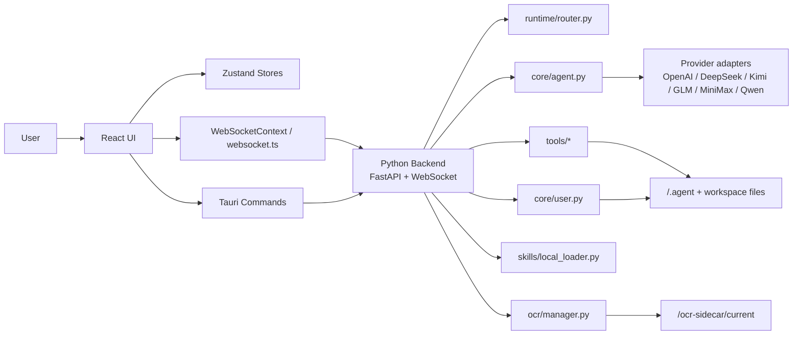
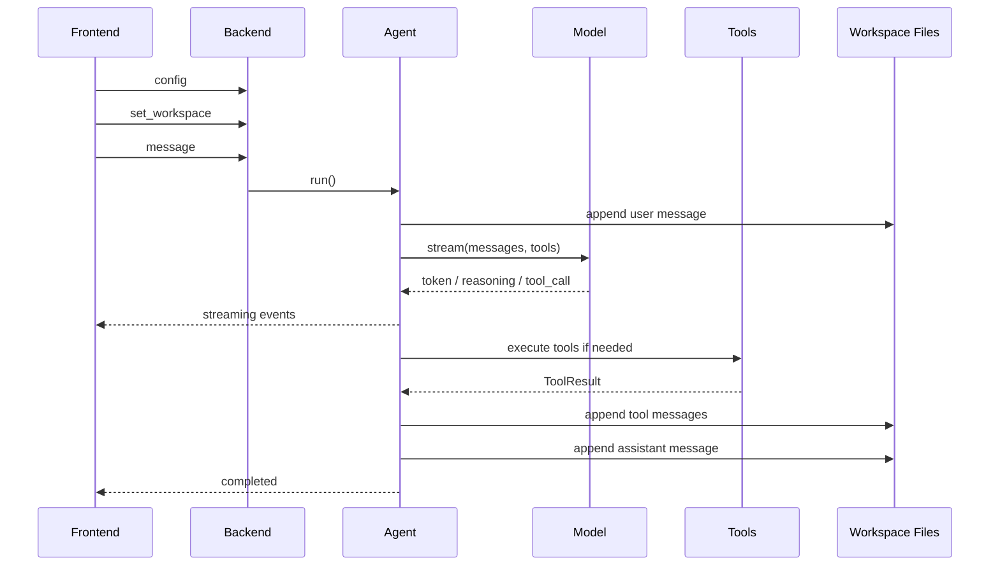

# work agent Architecture

本文档描述当前仓库中已经实现的架构，而不是未来设计稿。

## 1. 系统定位

`work agent` 是一个桌面端本地工作区 Agent，采用三层结构：

- `React + Vite + TypeScript`：页面、状态管理、交互与展示
- `Tauri + Rust`：桌面宿主、文件系统授权、Python sidecar 启停、OCR 安装桥接
- `Python + FastAPI + WebSocket`：Agent runtime、模型路由、工具执行、会话持久化

核心特点：

- 以工作区目录为边界进行文件访问
- 前后端通过 WebSocket 长连接驱动实时 agent loop
- 对话、工具、运行日志都能在工作区 `.agent/` 下落盘
- 支持双 profile 模型配置、长会话压缩、可选 OCR

## 2. 总体架构



## 3. 仓库模块

### 3.1 前端

```text
src/
  App.tsx
  pages/
  components/
  contexts/WebSocketContext.tsx
  services/websocket.ts
  stores/
  utils/
  i18n/
```

主要职责：

- 路由与页面壳层
- 通过 Zustand 保存聊天、会话、任务、配置、UI 状态
- 建立与后端的 WebSocket 连接
- 通过 Tauri command 读取会话历史、工作区技能、系统技能等
- 展示工具审批、提问卡片、运行时间线、文件树、任务树

### 3.2 Tauri / Rust

```text
src-tauri/
  src/main.rs
  src/lib.rs
  src/workspace_paths.rs
  src/session_storage.rs
  src/skill_catalog.rs
```

主要职责：

- 启动桌面应用
- 在桌面模式下拉起 Python `core` sidecar
- 暴露 Tauri command：
  - `prepare_workspace_path`
  - `authorize_workspace_path`
  - `scan_workspace_sessions`
  - `read_session_history`
  - `delete_session_history`
  - `open_workspace_folder`
  - `scan_system_skills`
  - `scan_workspace_skills`
  - `get_backend_auth_token`
  - `get_app_update_config_state`
  - `check_for_app_update`
  - `install_app_update`
  - `inspect_ocr_sidecar_installation`
  - `install_ocr_sidecar`
- 为工作区动态加入 Tauri FS scope
- 安装 OCR sidecar 到 `<app_dir>/ocr-sidecar/current`

### 3.3 Python 后端

```text
python_backend/
  main.py
  core/
  runtime/
  llms/
  tools/
  skills/
  document_readers/
  ocr/
```

主要职责：

- 维护运行时配置与连接状态
- 将前端会话绑定到工作区
- 驱动 agent loop
- 对接模型 provider
- 执行工具
- 在工作区中保存 transcript、metadata、run logs、memory snapshot

### 3.4 可选 OCR sidecar

```text
ocr_sidecar/
  server.py
  prepare_models.py
  manifest.json
```

这是一个独立可安装组件，不随运行时自动可用。  
主应用通过设置页安装后，后端再按需启动它。

## 4. 前端架构

### 4.1 路由

`src/App.tsx` 当前定义四个页面：

- `/` -> `WelcomePage`
- `/workspace/:workspaceId` -> `WorkspacePage`
- `/settings` -> `SettingsPage`
- `/about` -> `AboutPage`

只有 `settings` 和 `workspace/*` 会包裹 `WebSocketProvider`。

### 4.2 状态层

前端主要 store：

- `configStore`
  - 持久化模型配置、runtime、tools/skills/OCR 设置
- `workspaceStore`
  - 工作区列表
  - 当前工作区
  - 被 agent 写入过的文件高亮
- `sessionStore`
  - 会话元数据
  - 当前会话 id
  - 从磁盘恢复会话列表
- `chatStore`
  - 消息流
  - 当前 streaming 文本 / reasoning / tool 状态
- `runStore`
  - 运行事件时间线
- `taskStore`
  - `todo_task` 生成的任务树
- `uiStore`
  - 左右面板宽度
  - 主题
  - 语言
  - 字号

### 4.3 Workspace 页面

`WorkspacePage` 负责：

- 校验并授权工作区路径
- 加载该工作区会话列表
- 恢复当前会话历史
- 向后端发送 `set_workspace`
- 维护离开工作区保护
- 打开 run timeline modal

页面布局：

- 顶栏：工作区名、模型、OCR、WS、token usage、timeline
- 左侧：工作区信息、skills、tools、session list
- 中间：聊天区
- 右侧：文件树 / 任务面板

### 4.4 设置页

当前有六个标签页：

- `Model`
  - `primary` / `background` profile
  - provider/model/api_key/base_url
  - reasoning 开关
  - 连通性测试
- `Runtime`
  - `shared`
  - `conversation`
  - `background`
  - `compaction`
  - `delegated_task`
  - 自定义 system prompt
- `Tools`
  - 后端工具启用/禁用
- `Skills`
  - 是否启用 local skill provider
  - system skills 开关
  - system skill roots 展示
- `OCR`
  - OCR 功能开关
  - OCR sidecar 安装状态
  - OCR 安装入口
- `UI`
  - 语言
  - 主题
  - 字号

### 4.5 WebSocketContext

`src/contexts/WebSocketContext.tsx` 是前端协议中心，负责：

- 获取 auth token
- 发送 `config`
- 发送 `set_workspace`
- 发送 `message`
- 发送 `tool_confirm`
- 发送 `question_response`
- 发送 `interrupt`
- 发送 `set_execution_mode`
- 处理后端所有消息并分发到各个 store

它还会在工具结果后做两类前端副作用：

- `file_write` -> 标记文件树变更
- `todo_task` -> 更新任务面板

## 5. Tauri / 宿主层架构

### 5.1 工作区授权

工作区访问不是任意开放的，必须走：

1. `prepare_workspace_path`
2. `authorize_workspace_path`

Rust 层会：

- 校验路径存在且为目录
- 规范化 canonical path
- 将目录加入 Tauri FS scope

这使得：

- 文件树读取
- 会话扫描
- 历史读取
- 工作区技能扫描

都必须建立在已授权目录之上。

### 5.2 Python sidecar 启动

桌面模式下，`src-tauri/src/lib.rs` 会在应用生命周期内管理 Python sidecar：

- 生成或读取 backend auth token
- 将 token 通过环境变量注入 sidecar
- 启动名为 `core` 的 sidecar
- 在窗口关闭和应用退出时清理 sidecar

开发模式下，当前仓库通常通过 `./dev.sh` 手动先启动 `python_backend/main.py`。

### 5.3 OCR sidecar 安装

OCR 不是和主后端一起打包成同一个常驻进程。  
用户在设置页选择 OCR 目录后，Rust 层会把它复制到：

```text
<app_dir>/ocr-sidecar/current
```

之后 Python 后端再通过 `ocr/manager.py` 去探测、拉起和健康检查。

### 5.4 应用更新

Tauri updater 接口已经接入 About 页，但当前 `src-tauri/tauri.conf.json` 默认配置为：

- `endpoints: []`
- `pubkey: ""`

因此默认仓库配置下，更新检查 UI 会存在，但状态通常为不可用。

## 6. Python 后端架构

### 6.1 入口与全局状态

`python_backend/main.py` 负责：

- FastAPI app
- `/ws` WebSocket
- HTTP 接口
- 全局 `runtime_state`
- 全局 `tool_registry`
- 全局 `user_manager`
- 全局 `context_provider_registry`
- 全局 `ocr_manager`

`runtime_state` 当前维护：

- `current_config`
- `current_llm`
- `current_context_bundle`
- `active_agents`
- `authenticated_connections`
- `connection_workspaces`
- `active_session_tasks`
- `active_session_compaction_tasks`

### 6.2 HTTP 接口

当前已实现：

- `GET /`
- `GET /health`
- `GET /auth-token`
- `GET /tools`
- `POST /test-config`

说明：

- `/tools` 和 `/test-config` 需要 HTTP auth header
- `/auth-token` 在 host 管理 token 时可能返回 404

### 6.3 WebSocket 协议

客户端消息：

- `config`
- `set_workspace`
- `message`
- `tool_confirm`
- `question_response`
- `interrupt`
- `set_execution_mode`

服务端常见消息：

- `config_updated`
- `workspace_updated`
- `started`
- `token`
- `reasoning_token`
- `reasoning_complete`
- `tool_call`
- `tool_confirm_request`
- `tool_decision`
- `question_request`
- `tool_result`
- `completed`
- `interrupted`
- `retry`
- `max_rounds_reached`
- `session_title_updated`
- `session_lock_updated`
- `execution_mode_updated`
- `run_event`
- `error`

协议特点：

- 连接建立后必须先发 `config` 完成认证
- 发 `message` 前必须先发 `set_workspace`
- 服务端不会信任每条消息里的工作区覆盖值，而是以连接绑定工作区为准

## 7. 配置模型

`runtime/config.py` 会把前端配置标准化为统一结构：

```text
profiles:
  primary
  background?
runtime:
  shared
  conversation?
  background?
  compaction?
  delegated_task?
context_providers:
  skills.local.enabled
  skills.system.disabled[]
  tools.disabled[]
ocr:
  enabled
appearance:
  base_font_size
system_prompt
```

关键规则：

- conversation 使用 `primary`
- background / compaction / delegated_task 优先使用 `background`，否则回退到 `primary`
- runtime policy 由 `shared + role override` 合成
- provider base URL 会被补默认值
- OCR 开关和 tools/skills 开关都是真实运行时开关，不只是前端隐藏

## 8. Agent loop

`core/agent.py` 是主执行引擎。

### 8.1 一次对话主流程



### 8.2 关键行为

- user message 先写入会话文件
- 每轮最多执行 `max_tool_rounds`
- LLM 请求失败会按 `max_retries` 重试
- 运行事件会追加到 `.agent/logs/`
- 每个 tool result 也会回写入会话 transcript

### 8.3 会话锁模

第一次成功发送消息后：

- 会根据当前 conversation profile 生成 `locked_model`
- 写入 session metadata
- 后续该 session 必须继续使用同一 provider/model

### 8.4 会话标题

当会话还没有标题且首条消息有文本时：

- 后端会额外创建 background LLM
- 运行 `run_session_title_task`
- 成功后通过 `session_title_updated` 回前端

## 9. 工具执行与审批

### 9.1 工具注册

工具在 `main.py` 中显式注册。  
当前注册表以代码为准，而不是文档声明。

### 9.2 工具元数据

所有工具 schema 都会附带 `x-tool-meta`，来源于 `ToolDescriptor`：

- `display_name`
- `read_only`
- `risk_level`
- `preferred_order`
- `use_when`
- `avoid_when`
- `user_summary_template`
- `result_preview_fields`
- `tags`
- `policy`

### 9.3 审批逻辑

审批只对 `require_confirmation = True` 的工具生效。  
当前主要包括：

- `file_write`
- `shell_execute`
- `python_execute`
- `node_execute`

执行流程：

1. Agent 判断当前 session 的 execution mode
2. 若为 `free`，直接跳过审批
3. 若命中自动批准策略，直接通过
4. 否则通过 `tool_confirm_request` 等待前端决策

批准策略支持：

- 一次性批准
- 当前 session 永久批准
- 当前 workspace 永久批准

这些策略由 `UserManager` 持久化到本机策略文件。

### 9.4 交互式问题

`ask_question` 工具不会直接继续执行，而是：

- 后端发 `question_request`
- 前端展示待回答卡片
- 用户回复后再通过 `question_response` 继续

### 9.5 delegated task

`delegate_task` 会：

- 走 `background` profile
- 用严格 JSON 返回 `summary + data`
- 在前端消息流中展示 worker 卡片

它是后台子任务，不会直接复用主对话的逐 token UI。

## 10. Skills 架构

skills 由 `LocalSkillLoader` 管理。

默认搜索根：

- 应用目录 `skills/`
- app data `skills/`
- 当前工作区 `.agent/skills/`

行为规则：

- app skills 和 workspace skills 会按名称去重
- 同名时 workspace skills 优先
- system skills 的禁用列表只影响 app skills
- 整个 local skill provider 关闭后，`skill_loader` 也失去运行时意义

当前 skill catalog 的作用分两层：

1. 先把 skill 元数据注入模型上下文
2. 真正需要完整说明时，再调用 `skill_loader`

## 11. OCR 架构

OCR 由三部分组成：

- 设置页安装与启用
- Python `ocr/manager.py`
- `ocr_extract` 工具

运行方式：

1. Tauri 负责安装 sidecar 到 app 目录
2. Python backend 检查 manifest 与可执行文件
3. 首次需要 OCR 时按需拉起 sidecar
4. `ocr_extract` 调 sidecar HTTP 接口
5. 结果缓存到工作区 `.agent/cache/ocr/`

支持：

- 图片 OCR
- 扫描版 PDF 按页 OCR
- `text / lines / blocks` 三种 detail level

## 12. 会话持久化

`core/user.py` 中的 `Session` 负责会话文件。

### 12.1 transcript

每条消息以 JSONL 形式落到：

```text
<workspace>/.agent/sessions/<session-id>.jsonl
```

包含：

- `user`
- `assistant`
- `tool`
- reasoning 内容
- attachments
- usage
- tool calls

### 12.2 metadata

```text
<workspace>/.agent/sessions/<session-id>.meta.json
```

保存：

- `created_at`
- `updated_at`
- `title`
- `locked_model`

### 12.3 memory / compaction

```text
<workspace>/.agent/sessions/<session-id>.memory.json
<workspace>/.agent/sessions/<session-id>.compactions.jsonl
```

当前策略：

- 最近一次 assistant usage 会作为 compaction 判断依据
- `>= 60%`：后台预压缩
- `> 75%`：发送主请求前强制压缩

compaction 输出：

- memory snapshot
- compaction record
- run timeline 事件

原始 transcript 不会被覆盖掉。

## 13. 运行日志

每次运行相关事件写到：

```text
<workspace>/.agent/logs/<session-id>.jsonl
```

事件来源：

- `run_started`
- `tool_execution_started`
- `tool_confirmation_skipped`
- `retry_scheduled`
- `run_completed`
- `run_failed`
- `run_interrupted`
- `session_compaction_*`

前端 `RunTimeline` 直接消费同类事件。

## 14. 文件与工作区边界

路径解析通过 `tools/path_utils.py` 和 Tauri 授权共同约束。

当前边界规则：

- 有工作区时，工具优先在工作区内解析相对路径
- `file_write` 对无工作区的绝对路径有额外限制
- 命令执行工具以工作区作为 `cwd`
- 前端文件树只显示已授权工作区内容

需要注意：

- `web_fetch` 可以访问公网 URL
- LLM 请求会发送到用户配置的第三方模型服务
- “文件边界在工作区内”并不等于“完全离线”

## 15. 开发与测试

### 15.1 前端

- `npm install`
- `npm run tauri dev`
- `npm test`

### 15.2 后端

- `pip install -r python_backend/requirements.txt`
- `python python_backend/main.py`
- `pytest python_backend/tests`

### 15.3 OCR sidecar

- `pip install -r ocr_sidecar/requirements.txt`
- `pytest ocr_sidecar/tests`

## 16. 当前实现边界

以下是当前代码层面可以确认的边界：

- 更新检查 UI 已有，但默认仓库配置未提供更新源
- OCR 需要单独安装 sidecar，不是开箱即用
- provider 与 model 的“可选列表”目前由前端内置枚举决定
- workspace skills 会被扫描，但没有在设置页中逐条开关
- `web_fetch` 是简单 HTTP 获取，不执行 JavaScript

以上内容均以当前仓库代码为准。
