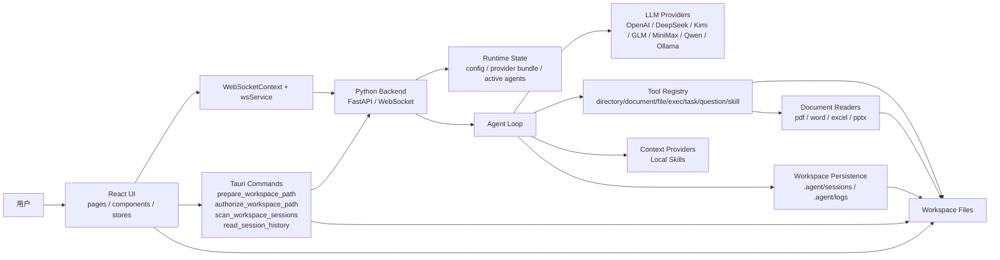
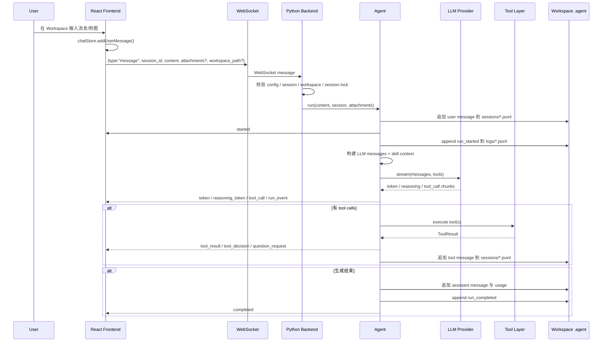
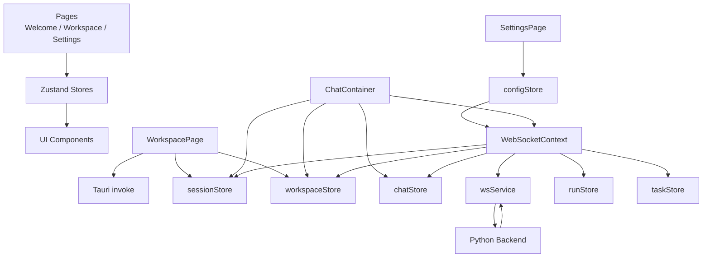
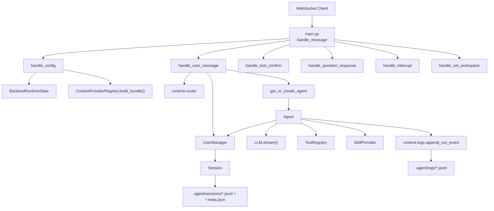
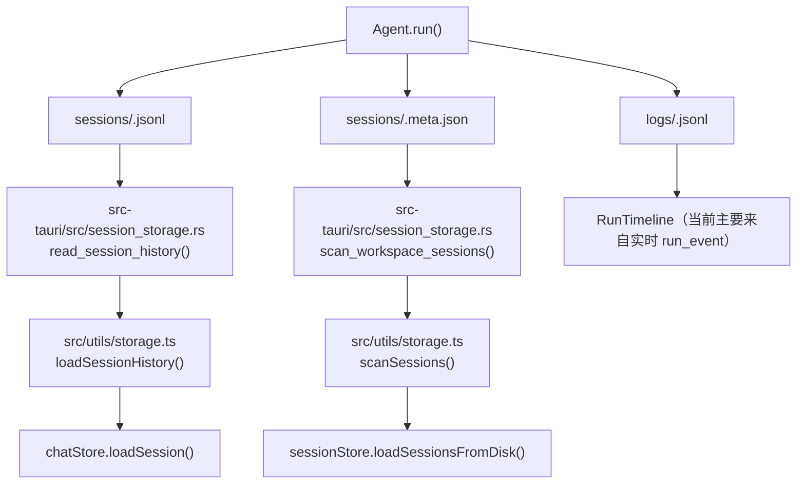

# Tauri Agent Architecture

## 1. 项目定位

`tauri_agent` 是一个桌面端 AI Agent 应用，采用三层结构：

- `React + Vite + TypeScript` 负责 UI、状态管理和交互编排
- `Tauri + Rust` 负责桌面容器、本地文件访问授权、发布态 sidecar 管理
- `Python + FastAPI + WebSocket` 负责 Agent runtime、LLM 调度、工具调用、会话持久化

它已经不是单纯的聊天壳子，而是一套面向本地工作区协作的 Agent 平台，当前核心能力包括：

- 多模型 Provider 配置与 profile 路由
- 基于 WebSocket 的流式对话与 reasoning 展示
- Tool calling、用户审批、交互式提问
- 基础文档工具优先、高级执行工具兜底的工具体系
- Local skills metadata catalog 注入与按需加载
- 工作区会话持久化、run timeline、token usage 展示
- session memory / compaction 与长会话上下文治理
- 图片输入与工作区文件联动

## 2. 系统总览



### 2.1 分层职责

| 层级 | 目录 | 核心职责 | 关键入口 |
| --- | --- | --- | --- |
| 前端展示层 | `src/` | 页面路由、聊天 UI、右侧文件树/任务面板、配置界面、状态恢复 | `src/App.tsx` |
| 桌面宿主层 | `src-tauri/` | 工作区路径规范化、动态 FS 授权、发布态 Python sidecar 启停、app data 注入 | `src-tauri/src/lib.rs` |
| Agent 运行时 | `python_backend/` | WebSocket 协议、配置标准化、Agent loop、工具执行、事件日志 | `python_backend/main.py` |
| 工作区持久化层 | `<workspace>/.agent/` | 会话 transcript、metadata、memory snapshot、compaction 审计、run logs | 运行时按需生成 |

## 3. 仓库结构与模块地图

### 3.1 顶层目录

| 目录 | 作用 |
| --- | --- |
| `src/` | React 前端代码 |
| `src-tauri/` | Tauri Rust 壳层与桌面权限 |
| `python_backend/` | FastAPI/WebSocket 后端、Agent runtime、tools、providers |
| `docs/` | 设计文档与实现计划 |
| `scripts/` | 辅助脚本与回归检查 |
| `public/` | 静态资源 |

### 3.2 前端模块地图

| 模块 | 关键文件 | 职责 | 输入 | 输出 |
| --- | --- | --- | --- | --- |
| 路由与应用壳 | `src/App.tsx` | 挂载 Router、WebSocketProvider、全局 LoadingOverlay | 浏览器路由、全局 store | 页面切换、上下文注入 |
| 页面层 | `src/pages/*.tsx` | Welcome / Workspace / Settings 三大页面 | store、Tauri invoke、HTTP/WebSocket | 页面状态与用户操作 |
| 通信层 | `src/contexts/WebSocketContext.tsx` `src/services/websocket.ts` | 建立 WebSocket、发送协议消息、分发后端事件 | ProviderConfig、聊天输入、工具确认 | chat/session/run/task/workspace store 更新 |
| 状态层 | `src/stores/*.ts` | Zustand 持有聊天、会话、工作区、配置、运行状态、UI 状态 | WebSocket 事件、用户操作 | 组件渲染数据 |
| 工作区 UI | `src/components/Workspace/*` | TopBar、SessionList、FileTree、TaskList | workspace/session/chat store | 工作区侧栏、文件变化高亮 |
| 聊天 UI | `src/components/Chat/*` | 消息流渲染、输入框、流式输出、interrupt、Markdown/GFM 正文展示、delegated worker 单行卡片与 detail modal | chat store、WebSocket actions | 消息发送、reasoning/tool 展示、worker 状态感知 |
| 工具交互 UI | `src/components/Tools/*` | ToolConfirmModal、PendingQuestionCard、ToolCallDisplay、ToolMessageDisplay | tool_confirm_request / question_request / tool_result | 审批、答复回传、业务化工具摘要 |
| 运行观测 UI | `src/components/Run/RunTimeline.tsx` | 渲染 `run_event` 为时间线 | run store、chat store | run 过程可视化 |
| 本地读取工具 | `src/utils/storage.ts` | 通过 Tauri command 恢复 session 列表与历史，并派生 UI 数据 | Tauri invoke | Session 列表、历史消息恢复 |

### 3.3 Tauri 模块地图

| 模块 | 关键文件 | 职责 |
| --- | --- | --- |
| 应用入口 | `src-tauri/src/main.rs` | 启动 Tauri 主程序 |
| 桌面壳层 | `src-tauri/src/lib.rs` | 注册命令、插件、发布态 sidecar 管理、关闭时回收 sidecar |
| 工作区路径授权 | `src-tauri/src/workspace_paths.rs` | 规范化路径、去重判断、给 Tauri FS scope 动态放行 |
| 会话磁盘桥接 | `src-tauri/src/session_storage.rs` | 在已授权 workspace 下扫描/读取/删除 `.agent/sessions` |
| 能力配置 | `src-tauri/capabilities/default.json` | 声明默认 FS/Dialog/Shell/Opener 能力 |

### 3.4 Python 后端模块地图

| 模块 | 关键文件 | 职责 | 输入 | 输出 |
| --- | --- | --- | --- | --- |
| 服务入口 | `python_backend/main.py` | FastAPI app、WebSocket 路由、HTTP health/test-config、全局 runtime_state | WebSocket/HTTP 请求 | 状态更新、Agent task、JSON 响应 |
| Agent Loop | `python_backend/core/agent.py` | 组装 LLM 消息、流式生成、工具执行、重试、中断、run_event 落盘 | Session、LLM、ToolRegistry、Skill providers | token/tool_call/tool_result/completed/run_event |
| 用户与会话 | `python_backend/core/user.py` | session 管理、消息持久化、memory / compaction artifact、连接绑定、工具审批与问题响应等待 | session_id、workspace_path、frontend 回调 | `.agent/sessions/*`、前端消息派发 |
| Runtime 配置 | `python_backend/runtime/config.py` | 标准化 provider/profile/runtime/context_providers 配置 | 前端发来的 config | 统一结构的 runtime config |
| Profile 路由 | `python_backend/runtime/router.py` | 决定 conversation/background/compaction profile、session lock 检查 | config、session metadata | profile 选择结果 |
| Context Provider 注册 | `python_backend/runtime/provider_registry.py` | 构建 skill provider bundle | normalized config | `ContextProviderBundle` |
| 运行事件 | `python_backend/runtime/events.py` `python_backend/runtime/logs.py` | 定义并写入 run_event | Agent loop 阶段事件 | `.agent/logs/*.jsonl` |
| LLM Provider | `python_backend/llms/*.py` | 对接 OpenAI 兼容 API、provider 特定 reasoning/usage 适配、Kimi 温度约束 | messages、tools、runtime policy | 流式 chunk / completion |
| Tool 系统 | `python_backend/tools/*.py` | 统一文档工具、PDF 专家工具、文件写入、执行、任务、提问、skill 加载等工具 | tool call arguments | ToolResult + descriptor metadata |
| 文档 Reader | `python_backend/document_readers/*.py` | 按格式解析 `pdf/docx/xlsx/pptx`，向主工具提供结构、搜索和片段读取能力 | workspace 文件路径 | 结构化文档快照与定位结果 |
| Context Providers | `python_backend/skills/*` | 扫描本地 skill metadata catalog，并按名称加载 skill 正文 | app data skill root、workspace path | 附加到 system prompt 的 metadata 与 `skill_loader` 运行时加载结果 |

## 4. 关键功能视图

| 功能域 | 实现位置 | 说明 |
| --- | --- | --- |
| 多 Provider 配置 | `src/pages/SettingsPage.tsx` `python_backend/runtime/config.py` | 支持 OpenAI / DeepSeek / Kimi / GLM / MiniMax / Qwen / Ollama，前后端各自做 normalize |
| Provider 配置记忆 | `src/pages/SettingsPage.tsx` `src/utils/config.ts` | 前端持久化 `provider_memory`，切换 provider 时恢复上次保存的 `model / api_key / base_url` |
| 主/后台模型 profile | `src/types/index.ts` `python_backend/runtime/router.py` | `primary` 负责主对话，`background` 负责标题生成、compaction 与 delegated task 等后台任务 |
| 会话锁模 | `src/components/Chat/ChatContainer.tsx` `python_backend/main.py` | 首次发送消息时锁定 session 的 provider/model，后续必须匹配 |
| 流式文本与 reasoning | `src/contexts/WebSocketContext.tsx` `python_backend/core/agent.py` | 分别消费 `token` 与 `reasoning_token`，最后由 `reasoning_complete` 收束 |
| Tool Calling | `python_backend/core/agent.py` `python_backend/tools/base.py` | LLM 输出 tool calls，后端并发执行工具并回传结果，schema 中附带 `x-tool-meta` descriptor 扩展信息 |
| 文档工具主链路 | `python_backend/tools/get_document_structure.py` `python_backend/tools/search_documents.py` `python_backend/tools/read_document_segment.py` | 统一覆盖“看结构 -> 搜命中 -> 读片段”，对外收口到稳定工具面 |
| 文档格式解析 | `python_backend/document_readers/pdf_reader.py` `python_backend/document_readers/word_reader.py` `python_backend/document_readers/excel_reader.py` `python_backend/document_readers/pptx_reader.py` | 底层按格式拆分，分别处理 PDF 视觉行、Word 段落/表格、Excel sheet/单元格、PPTX slide 文本 |
| Tool 审批 | `src/components/Tools/ToolConfirmModal.tsx` `python_backend/core/user.py` | 对需要确认的工具建立 pending future，前端按只读/写入/高级执行风险展示审批文案 |
| 交互式提问 | `src/components/Tools/PendingQuestionCard.tsx` `python_backend/core/agent.py` | `ask_question` 工具通过 WebSocket 向用户发问并等待回答 |
| Delegated Task | `python_backend/runtime/delegation.py` `python_backend/tools/delegate_task.py` `src/components/Chat/DelegatedWorkerCards.tsx` | `delegate_task` 使用 background model 执行只读子任务，并在消息流中展示 worker 卡片与 detail modal |
| 工具业务化展示 | `src/components/Tools/ToolCallDisplay.tsx` `src/components/Tools/ToolMessageDisplay.tsx` `src/utils/toolMessages.ts` | 把工具调用与结果渲染成“正在做什么 / 风险类型 / 结果摘要 / 技术详情” |
| Run Timeline | `src/components/Run/RunTimeline.tsx` `python_backend/runtime/events.py` | run_event 同时写入前端和磁盘日志 |
| 工作区文件联动 | `src/utils/storage.ts` `src/components/Workspace/FileTree.tsx` | 前端经 Tauri 读取工作区文件；`file_write` 成功后高亮变更文件 |
| Session 历史恢复 | `src/utils/storage.ts` `src-tauri/src/session_storage.rs` | session list / transcript 通过 Tauri command 读取，不再直接走前端 `plugin-fs` |
| 任务面板 | `src/stores/taskStore.ts` `python_backend/tools/todo_task.py` | `todo_task` 结果转成前端任务树 |
| 会话标题生成 | `python_backend/runtime/session_titles.py` `src/stores/sessionStore.ts` | 首条文本消息触发后台标题任务，结果以 `session_title_updated` 回传 |
| Token Usage Widget | `src/components/common/TokenUsageWidget.tsx` `python_backend/llms/base.py` | 后端从 provider usage 归一化后，前端显示最近一次 session usage |
| Session Compaction | `python_backend/core/agent.py` `python_backend/core/user.py` `python_backend/runtime/contracts.py` | 基于上一轮真实 `prompt_tokens / context_length` 触发 background / forced compaction，保留 memory + recent raw replay |
| Workspace / Session 离开保护 | `src/pages/WorkspacePage.tsx` `src/hooks/useSession.ts` `python_backend/main.py` | 离开 workspace 时对 streaming/compacting 弹确认；切换 session 时仅对 streaming 弹确认并先 interrupt |

## 5. 一次消息的完整运行链路

### 5.1 主链路时序图



### 5.2 链路拆解

#### A. 配置注入

1. 前端 `SettingsPage` 保存配置到 `configStore`
2. `WebSocketContext` 监听连接状态，连接建立后自动发送标准化 `config`
3. 后端 `handle_config()` 调用 `normalize_runtime_config()` 统一配置格式
4. 后端基于配置创建：
   - 当前默认 LLM
   - `ContextProviderBundle`
   - 清空已有 `active_agents`

#### B. 工作区建立与授权

1. Welcome 页面通过 Tauri `prepare_workspace_path` 做路径规范化和去重判断
2. 进入 Workspace 页面后再次调用 `authorize_workspace_path`
3. Rust 层把该目录加入 Tauri FS scope，供文件树等通用工作区访问使用
4. session list / history 恢复通过 Tauri command 再次复用该授权读取 `.agent/sessions`
5. 前端再发送 WebSocket `set_workspace`，让后端把连接绑定到当前 workspace

#### C. 会话创建与锁模

1. `ChatContainer` 第一次发送消息时，如果没有当前 session，则创建新 session id
2. 前端先把 `locked_model` 写入 `sessionStore`
3. 后端收到消息后：
   - 若 session 不存在，则在对应 workspace 创建 `Session`
   - 若已有 `locked_model`，必须与当前 conversation profile 匹配
   - 若还未锁模，则以后端解析出的 profile 写入 metadata 并回发 `session_lock_updated`

#### D. Agent 执行

1. `Agent.run()` 先将 user message 写入 `.agent/sessions/<session-id>.jsonl`
2. 发出 `started`
3. 构建 LLM messages：
   - 基础消息来自 session history
   - 若存在 `.memory.json`，则按 `memory + recent raw turns` 形式回放，而不是永远全量 raw history
   - replay plan 会读取最近一次 assistant usage 的 `prompt_tokens / context_length`，据此决定是否触发 compaction
   - 若启用 local skills，则扫描 app data 与 workspace 两处 skill root
   - 把每个 skill 的 YAML frontmatter catalog 拼入 system prompt
   - 需要完整 skill 指令时，由模型调用 `skill_loader`
   - 工具列表通过 OpenAI-compatible function schema 暴露，并附带 `x-tool-meta`
   - 文档任务优先走 `get_document_structure`、`search_documents`、`read_document_segment`
   - 若是 PDF 精细读取任务，可进一步调用 `pdf_get_outline`、`pdf_read_lines` 等格式专属工具
4. 调用 provider 的 `stream()`

#### D-1. Session Compaction

`Agent._build_llm_messages()` 在主请求发出前会先执行上下文治理：

1. 读取该 session 最近一次已完成 assistant message 的 usage
2. 用 `prompt_tokens / context_length` 计算 usage ratio
3. 若 ratio `>=60%`，且存在足够旧的可压前缀，则调度后台预压缩
4. 若 ratio `>75%`，则先做同步 forced compaction，再发送主请求
5. compaction 结果写入：
   - `.agent/sessions/<session-id>.memory.json`
   - `.agent/sessions/<session-id>.compactions.jsonl`
6. compaction model 优先走 `background` profile；未配置时回退 `primary`
7. run timeline 会记录 `session_compaction_started/completed/failed/skipped`

#### E. 流式回传与工具执行

1. `reasoning_token` 持续写入前端 `currentReasoningContent`
2. `token` 持续写入前端 `currentStreamingContent`
3. 若出现 `tool_calls`：
   - 后端先回 `tool_call`
   - 再并发执行工具
   - 需要审批时通过 `tool_confirm_request` 阻塞等待用户决策
   - `ask_question` 工具通过 `question_request` 阻塞等待用户响应
4. 工具结果会同时：
   - 回前端 `tool_result`
   - 追加 tool message 到 session transcript
   - 追加 `tool_execution_completed` 到 run logs

#### F. 结束、失败与中断

1. 正常结束时回 `completed`，附带 latest usage
2. 达到最大工具轮次时回 `max_rounds_reached`
3. 运行出错时回 `error`
4. 用户点 interrupt 时前端发 `interrupt`，后端设置 `Agent._interrupt_event` 并最终回 `interrupted`
5. `interrupt(session_id)` 也会显式取消该 session 的后台 compaction task

## 6. 前端内部数据流



### 6.1 Zustand stores 职责分工

| Store | 职责 | 数据来源 | 被谁消费 |
| --- | --- | --- | --- |
| `chatStore` | 会话消息、流式 token、reasoning、tool 结果、pending question/confirm、latest usage | WebSocket 消息、用户输入 | Chat UI、TopBar TokenUsage |
| `sessionStore` | 当前 session、session metadata、磁盘扫描结果 | `scanSessions()`、`session_title_updated`、`session_lock_updated` | Sidebar、ChatContainer |
| `workspaceStore` | workspace 列表、当前 workspace、changedFiles | Welcome/Workspace 页面、`file_write` 结果 | Welcome、FileTree、TopBar |
| `configStore` | provider/profile/runtime/context provider 配置 | SettingsPage | WebSocketContext、LeftPanel、ModelDisplay |
| `runStore` | 按 session 聚合的运行事件与生命周期状态 | `run_event` | RunTimeline |
| `taskStore` | `todo_task` 派生出的任务树 | `tool_result` | TaskList |
| `uiStore` | 左右栏折叠、theme、右栏 tab、loading | 用户操作 | 各页面与布局组件 |

### 6.2 前端恢复机制

前端不是完全依赖内存状态，存在两类恢复来源：

- 浏览器持久化：`workspaceStore`、`sessionStore`、`configStore` 通过 Zustand `persist` 保存
- 工作区磁盘恢复：`src/utils/storage.ts` 通过 Tauri command 读取 `.agent/sessions/*.jsonl` 与 `*.meta.json`

其中最关键的一点是：

- 后端落盘的是“原始消息”
- 前端加载历史时会重新派生 `reasoning` 消息、tool decision 文案、tool result 摘要与业务化工具展示

也就是说，历史 UI 是“磁盘原始数据 + 前端派生逻辑”的组合，不是完整的 UI snapshot。

## 7. 后端内部数据流



### 7.1 `BackendRuntimeState` 持有什么

全局运行态主要包含：

- `active_agents`: 每个 session 对应一个 Agent 实例
- `current_llm`: 当前默认 conversation LLM
- `current_config`: 当前标准化后的配置
- `current_context_bundle`: 当前 skill provider bundle
- `connection_workspaces`: WebSocket 连接绑定到哪个 workspace
- `pending_tasks`: 所有异步任务
- `active_session_tasks`: 每个 session 当前是否已有运行中的任务

这意味着后端的并发控制是“按 session 串行、按 tool 并发”的：

- 同一个 session 不能同时跑两次 agent
- 同一轮中多个工具可以并发执行

### 7.2 Agent Loop 关键阶段

`Agent.run()` 的稳定阶段如下：

1. 写入用户消息
2. 发 `run_started`
3. 扫描 local skill catalog metadata，并在需要时通过 `skill_loader` 加载正文
4. 向模型暴露完整工具 schema 与 descriptor metadata
5. 调用 LLM 流式输出
6. 若无工具调用则直接结束
7. 若有工具调用则执行并写入 tool message
8. 进入下一轮，直到生成完成或达到 `max_tool_rounds`

### 7.3 Tool 执行模型

Tool 系统当前注册了以下内置工具：

- `list_directory_tree`
- `search_documents`
- `read_document_segment`
- `get_document_structure`
- `pdf_get_info`
- `pdf_get_outline`
- `pdf_read_pages`
- `pdf_read_lines`
- `pdf_search`
- `file_read`
- `file_write`
- `shell_execute`
- `python_execute`
- `node_execute`
- `todo_task`
- `ask_question`
- `delegate_task`
- `skill_loader`

它们统一通过 `ToolRegistry` 暴露为 OpenAI-compatible function schemas，供 LLM 生成 tool call。

当前工具体系按职责大致分为五层：

- 基础文档工具：
  - `list_directory_tree`
  - `search_documents`
  - `read_document_segment`
  - `get_document_structure`
- PDF 专家工具：
  - `pdf_get_info`
  - `pdf_get_outline`
  - `pdf_read_pages`
  - `pdf_read_lines`
  - `pdf_search`
- 通用工作区工具：
  - `file_read`
  - `file_write`
  - `skill_loader`
- 高级 fallback 执行工具：
  - `shell_execute`
  - `python_execute`
  - `node_execute`
- UI/交互工具：
  - `todo_task`
  - `ask_question`
  - `delegate_task`

当前不按任务场景裁剪工具集合，而是通过 descriptor 元数据来影响模型偏好与前端展示。

`ToolDescriptor` 除基础字段外，还包含：

- `display_name`
- `read_only`
- `risk_level`
- `preferred_order`
- `use_when`
- `avoid_when`
- `user_summary_template`
- `result_preview_fields`
- `tags`

这些信息会通过 schema 中的 `x-tool-meta` 一起暴露。

设计约束如下：

- 基础文档工具优先解决“知道有什么、搜到在哪、读局部证据、理解章节结构”
- `shell_execute`、`python_execute`、`node_execute` 保留给 LLM 作为最后的强力兜底工具
- 认证/条款/规则判断等更强业务语义，优先放在 skill 层而不是继续膨胀底层工具数
- 路径访问统一通过共享 path utils 做 workspace 边界校验与安全解析

执行阶段的统一输出结构是：

- `tool_call_id`
- `tool_name`
- `success`
- `output`
- `error`
- `metadata`

其中前端特别消费三类工具结果：

- `file_write`：标记文件树中的变更文件
- `todo_task`：更新任务面板
- `delegate_task`：在消息流中聚合 worker 状态卡，并通过 modal 展示 summary、structured data 与错误信息

而通用展示层会额外基于工具 metadata 和结果内容，生成：

- 业务动作摘要
- 风险标签，如 `只读`、`会修改文件`、`高级执行`
- 技术详情折叠视图

## 8. 接口契约

### 8.1 前端 <-> Tauri 命令接口

| 命令 | 发送方 | 参数 | 返回值 | 用途 |
| --- | --- | --- | --- | --- |
| `prepare_workspace_path` | WelcomePage | `selected_path` `existing_paths` | `existing` 或 `created` + `canonical_path` | 新建/打开工作区前去重与路径规范化 |
| `authorize_workspace_path` | WorkspacePage | `selected_path` | `canonical_path` | 将工作区加入 Tauri FS scope |
| `scan_workspace_sessions` | `storage.ts` | `workspace_path` | session metadata 列表 | 扫描 `.agent/sessions` 恢复 sidebar session list |
| `read_session_history` | `storage.ts` | `workspace_path` `session_id` | `content` | 读取单个 session transcript 用于消息恢复 |
| `delete_session_history` | `storage.ts` | `workspace_path` `session_id` | `void` | 删除 session transcript 与 metadata |

### 8.2 前端 -> Python Backend WebSocket 消息

| type | 主要字段 | 后端处理函数 | 作用 |
| --- | --- | --- | --- |
| `config` | provider/model/profiles/provider_memory?/runtime/context_providers | `handle_config` | 注入运行时配置 |
| `message` | session_id/content/attachments?/workspace_path? | `handle_user_message` | 发起一次 agent 运行 |
| `tool_confirm` | tool_call_id/decision/scope/approved | `handle_tool_confirm` | 工具审批结果 |
| `question_response` | tool_call_id/answer/action | `handle_question_response` | 对 `ask_question` 的答复 |
| `interrupt` | session_id | `handle_interrupt` | 中断当前 run |
| `set_workspace` | workspace_path | `handle_set_workspace` | 把 WebSocket 连接绑定到工作区 |

### 8.3 Python Backend -> 前端 WebSocket 消息

| type | 消费位置 | 作用 |
| --- | --- | --- |
| `started` | `chatStore.markUserMessageSent` + `startStreaming` | run 开始 |
| `token` | `chatStore.addToken` | 流式正文 |
| `reasoning_token` | `chatStore.addReasoningToken` | 流式 reasoning |
| `reasoning_complete` | `chatStore.setReasoningComplete` | 将 reasoning 固化为消息 |
| `tool_call` | `chatStore.setToolCall` | 展示工具调用 |
| `tool_confirm_request` | `chatStore.setPendingToolConfirm` | 打开工具审批弹窗 |
| `tool_decision` | `chatStore.addToolDecision` | 记录审批结果 |
| `question_request` | `chatStore.setPendingQuestion` | 打开提问卡片 |
| `tool_result` | `chatStore.setToolResult` | 展示工具结果并触发任务面板、文件高亮与业务摘要派生更新 |
| `completed` | `chatStore.setCompleted` | 固化 assistant 消息并记录 usage |
| `retry` | 控制台日志 | 提示本轮重试 |
| `error` | `chatStore.setError` | 记录错误消息 |
| `max_rounds_reached` | `chatStore.setError` | 达到最大工具轮次 |
| `interrupted` | `chatStore.setInterrupted` | 保留部分输出并结束流式态 |
| `config_updated` | 控制台日志 | 配置更新确认 |
| `workspace_updated` | 控制台日志 | 工作区绑定确认 |
| `session_title_updated` | `sessionStore.updateSession` | 更新 session 标题 |
| `session_lock_updated` | `sessionStore.updateSession` | 更新锁模 metadata |
| `run_event` | `chatStore.addRunEvent` + `runStore.addEvent` | 运行轨迹可视化 |

### 8.4 HTTP 接口

| 路径 | 方法 | 用途 |
| --- | --- | --- |
| `/health` | `GET` | 开发态检测 Python backend 是否已启动 |
| `/test-config` | `POST` | 在 Settings 页面测试 provider 连通性 |
| `/` | `GET` | 返回当前 backend 运行信息 |

### 8.5 配置契约

前后端围绕同一个逻辑配置模型运转：

```json
{
  "provider": "openai",
  "model": "gpt-4o-mini",
  "api_key": "YOUR_KEY",
  "base_url": "https://api.openai.com/v1",
  "enable_reasoning": false,
  "profiles": {
    "primary": {
      "profile_name": "primary",
      "provider": "openai",
      "model": "gpt-4o-mini"
    },
    "background": {
      "profile_name": "background",
      "provider": "openai",
      "model": "gpt-4.1-mini"
    }
  },
  "provider_memory": {
    "openai": {
      "model": "gpt-4o-mini",
      "api_key": "YOUR_KEY",
      "base_url": "https://api.openai.com/v1"
    },
    "kimi": {
      "model": "kimi-k2.5",
      "api_key": "YOUR_KIMI_KEY",
      "base_url": "https://api.moonshot.cn/v1"
    }
  },
  "runtime": {
    "shared": {
      "context_length": 64000,
      "max_output_tokens": 4000,
      "max_tool_rounds": 20,
      "max_retries": 3,
      "timeout_seconds": 120
    },
    "background": {
      "max_output_tokens": 2048
    },
    "delegated_task": {
      "timeout_seconds": 180
    }
  },
  "context_providers": {
    "skills": {
      "local": { "enabled": true }
    }
  }
}
```

补充说明：

- `profiles.primary/background` 是后端真正参与运行的配置
- `runtime.shared` 是默认值，`runtime.conversation/background/compaction/delegated_task` 是按 role 的 override
- `provider_memory` 是前端设置页的辅助持久化字段，用于在切换 provider 时恢复该 provider 最近保存的 `model / api_key / base_url`
- 后端标准化配置时不会依赖 `provider_memory`

### 8.6 会话与运行事件契约

#### Session metadata

`*.meta.json` 主要保存：

- `session_id`
- `workspace_path`
- `created_at`
- `updated_at`
- `title`
- `locked_model`

#### Run event

每条 `run_event` 主要包含：

- `event_type`
- `session_id`
- `run_id`
- `step_index`
- `payload`
- `timestamp`

常见 `event_type`：

- `run_started`
- `skill_catalog_prepared`
- `skill_loaded`
- `tool_call_requested`
- `tool_execution_started`
- `tool_execution_completed`
- `delegated_task_started`
- `delegated_task_completed`
- `question_requested`
- `question_answered`
- `retry_scheduled`
- `run_completed`
- `run_interrupted`
- `run_failed`
- `run_max_rounds_reached`

## 9. 前后端接口匹配情况

这一部分是理解项目最关键的地方：协议虽然比较清晰，但不是“真正的共享 schema 代码生成”，而是“前后端手工镜像 + 各自再加工”。

### 9.1 匹配良好的部分

| 领域 | 前端定义 | 后端定义 | 匹配情况 |
| --- | --- | --- | --- |
| WebSocket 消息类型 | `src/types/index.ts` | `python_backend/main.py` 各 handler 与 send payload | 语义一致，字段命名整体对齐 |
| `LockedModelRef` | `src/types/index.ts` | `python_backend/runtime/contracts.py` | 结构一致 |
| `run_event` | `RunEventRecord` | `RunEvent` | 字段一一对应 |
| provider config 逻辑模型 | `ProviderConfig` | `normalize_runtime_config()` 输出结构 | 运行时主结构一致；`provider_memory` 为前端辅助字段 |
| token usage | `TokenUsage` | `BaseLLM._set_latest_usage()` | 字段一致，支持 `reasoning_tokens/context_length` |

### 9.2 需要理解“不是原样直传”的部分

| 领域 | 实际情况 | 影响 |
| --- | --- | --- |
| `tool_call.arguments` | LLM 流里原始是 JSON 字符串片段，后端组装后再转对象回前端 | 前端拿到的不是 provider 原始 chunk，而是后端归一化结果 |
| 历史 reasoning 消息 | 后端落盘在 assistant message 的 `reasoning_content` 字段中 | 前端恢复历史时再拆成 `role: reasoning` 的展示消息 |
| tool decision / tool result 历史消息 | 后端落盘的是工具原始文本结果 | 前端加载历史时通过 `toolMessages` 工具重新派生摘要和状态 |
| workspace/session/config 持久化 | 前端部分保存在 Zustand persist，后端 session/log 保存在 workspace 磁盘 | 调试时要区分“浏览器状态”和“工作区状态” |

### 9.3 当前最值得注意的接口风险

1. 配置标准化逻辑前后端各自实现一份
前端在 `src/utils/config.ts`，后端在 `python_backend/runtime/config.py`。它们现在是对齐的，但没有共享源，未来扩字段时存在漂移风险。

2. WebSocket 类型没有自动 schema 校验
前端 `src/types/index.ts` 和后端发送 payload 靠约定保持一致，新增字段时如果一边漏改，问题会在运行期才暴露。

3. 历史消息恢复依赖前端派生逻辑
磁盘里不是最终 UI 结构，而是原始 transcript。也就是说 UI 规则变了，历史显示效果也可能变化。

## 10. 数据持久化模型

### 10.1 文件结构

```text
<workspace>/
  .agent/
    sessions/
      <session-id>.jsonl
      <session-id>.meta.json
    logs/
      <session-id>.jsonl
```

### 10.2 数据落盘图



### 10.3 三类文件分别存什么

| 文件 | 生产方 | 内容 | 消费方 |
| --- | --- | --- | --- |
| `sessions/<id>.jsonl` | `Session.add_message_async()` | user/assistant/tool 原始消息 transcript | 前端历史恢复、后端继续上下文 |
| `sessions/<id>.meta.json` | `Session.save_metadata()` | title、locked_model、创建更新时间 | SessionList、会话锁模 |
| `logs/<id>.jsonl` | `append_run_event()` | 结构化运行事件 | run 审计、时间线、调试 |

## 11. 模块间数据流总结

### 11.1 配置流

`SettingsPage`
-> `configStore`
-> `WebSocketContext.sendConfig()`
-> `python_backend/main.py.handle_config()`
-> `normalize_runtime_config()`
-> `create_llm()` + `ContextProviderRegistry.build_bundle()`

### 11.2 会话流

`ChatContainer`
-> `sessionStore/createSession`
-> WebSocket `message`
-> `UserManager.create_session()`
-> `Session` 文件落盘
-> `session_title_updated/session_lock_updated`
-> `sessionStore.updateSession`

### 11.3 内容生成流

`MessageInput`
-> WebSocket `message`
-> `Agent.run()`
-> `LLM.stream()`
-> `token/reasoning_token/tool_call`
-> `chatStore`
-> `MessageList`

### 11.4 工具交互流

`Agent._execute_single_tool()`
-> `tool_confirm_request` 或 `question_request`
-> 前端 Modal/Card
-> `tool_confirm/question_response`
-> `UserManager` future resolve
-> 工具继续执行
-> `tool_result`
-> `chatStore/taskStore/workspaceStore`

### 11.5 文件联动流

`file_write`
-> backend `tool_result.output = { event: "file_write", path, change }`
-> `WebSocketContext.applyFileWriteToolResult()`
-> `workspaceStore.markChangedFile()`
-> `FileTree` 高亮文件

### 11.6 任务联动流

`todo_task`
-> backend `tool_result.output = { event: "todo_task", action, task }`
-> `WebSocketContext.applyTodoToolResult()`
-> `taskStore.upsertTask/removeTask()`
-> `TaskList` 更新

## 12. 当前架构的优点与局限

### 12.1 优点

- 分层边界清晰，前端、桌面壳、Agent runtime 职责明确
- WebSocket 协议统一承载主要交互，流式体验和交互式工具都能覆盖
- 工作区持久化基于普通文件，易于审计与迁移
- run_event 单独建模，便于做 timeline、调试和后续观测增强
- Tool、LLM、Context Provider 都是可扩展点
- release 模式通过 Tauri sidecar 打包 Python backend，部署形态完整

### 12.2 局限与演进方向

- 前后端没有共享 schema 生成链，协议扩展需要人工双改
- 配置 normalize 重复实现，未来建议抽共享 schema 或契约测试
- run logs 已落盘，但前端更多依赖实时事件，历史 run 回放能力仍可继续加强
- 当前工作区数据访问高度依赖 Tauri FS scope 授权逻辑，跨平台边界要持续验证
- 工具执行策略已支持确认与策略缓存，但更细粒度的权限系统仍有提升空间

## 13. 新同学建议阅读路径

如果是第一次接手这个项目，建议按下面顺序阅读：

1. `README.md`
2. `src/App.tsx`
3. `src/pages/WorkspacePage.tsx`
4. `src/contexts/WebSocketContext.tsx`
5. `src/stores/chatStore.ts`
6. `python_backend/main.py`
7. `python_backend/core/agent.py`
8. `python_backend/core/user.py`
9. `python_backend/runtime/config.py`
10. `src-tauri/src/lib.rs`

这样可以最快建立“页面 -> WebSocket -> Agent -> 持久化 -> 桌面授权”的主干认知。

## 14. 一句话总结

这个项目的本质是：

一个以工作区为边界、以 WebSocket 为主通道、以 Python Agent runtime 为核心执行引擎、以 Tauri 负责桌面与本地权限托管的多层本地 AI Agent 平台。
